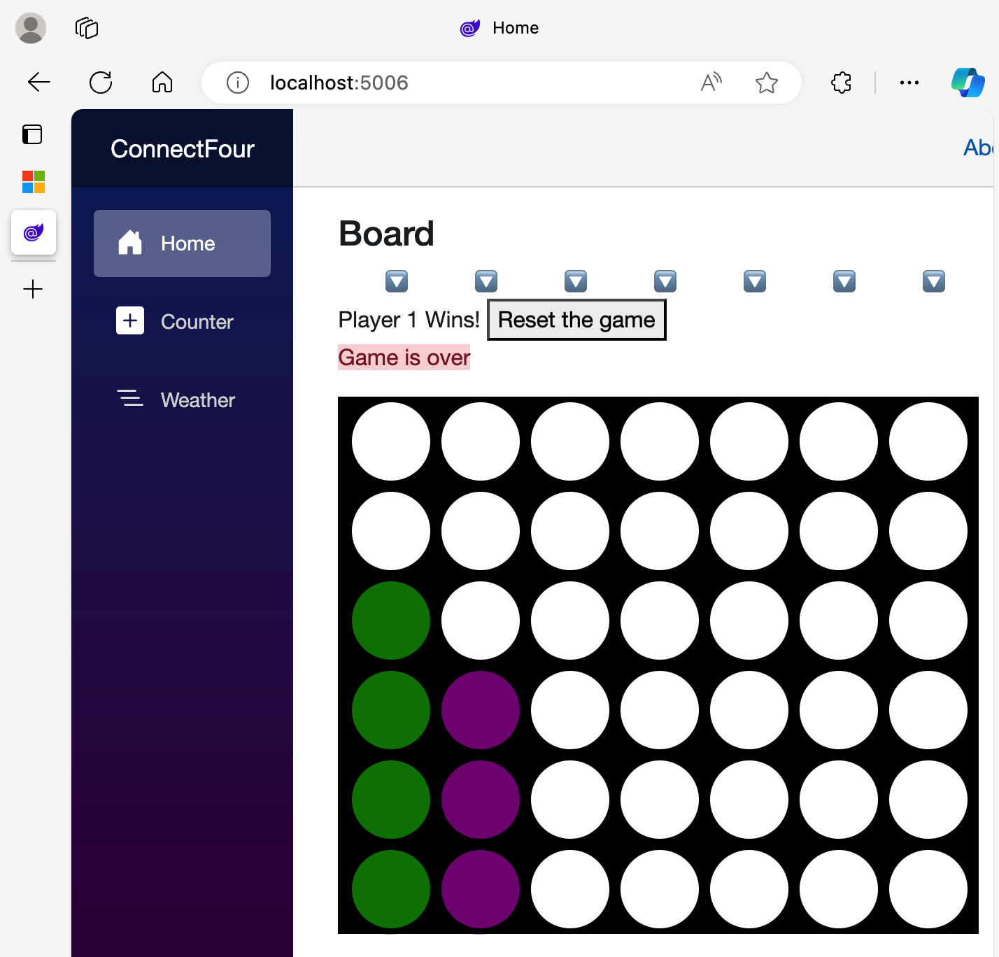
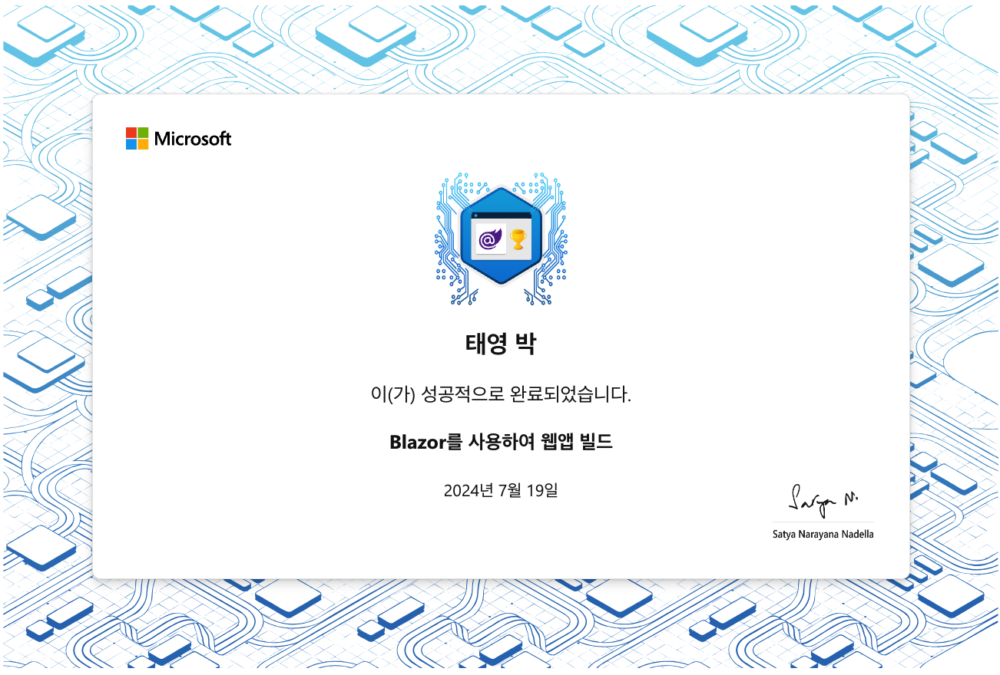

# README

> [ms learn| 블레이저 F/W 커넥트빌드 데모](https://learn.microsoft.com/ko-kr/training/modules/dotnet-connect-four/)를 따라한 레포  
> [ms learn| Blazor를 사용하여 웹앱 빌드](https://learn.microsoft.com/ko-kr/training/paths/build-web-apps-with-blazor/)를 순서대로 이수!


구동 방법은 아래와 같음
```shell
cd ConnectFour
dotnet build
dotnet run
```
  
그 다음 아래 주소로 접속하여 확인  
[http://localhost:5006/](http://localhost:5006/)


## 사진 모음

- 잘 돌아가는 커넥트빌드 게임~



- MS Learn 이수증!

